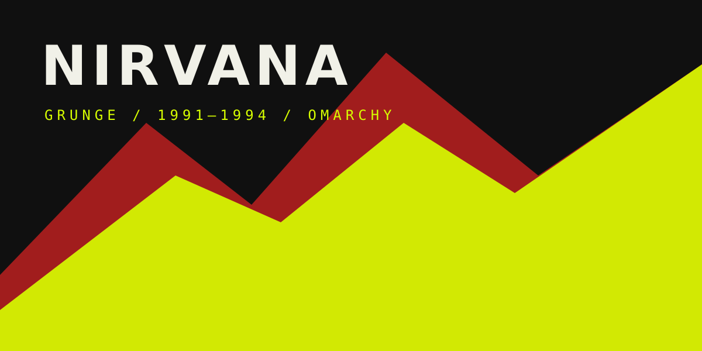

# Nirvana — Omarchy theme

Tema no oficial inspirado en la estética grunge de Nirvana: negro, amarillo ácido, rojo escenario, contraste fotocopiado y terminales de alto impacto.

No es un producto oficial de Nirvana ni de sus miembros. No incluye portadas ni fotografías comerciales protegidas; los fondos incluidos son obras originales vectoriales y fotografías reales con licencia abierta. Consulta `backgrounds/SOURCES.txt`.

```bash
omarchy theme install https://github.com/ciprianotoor/omarchy-nirvana-theme
omarchy theme set nirvana
omarchy theme bg next
```

Para añadir material autorizado por el usuario, copia imágenes 4K a `~/.config/omarchy/backgrounds/nirvana/`.
